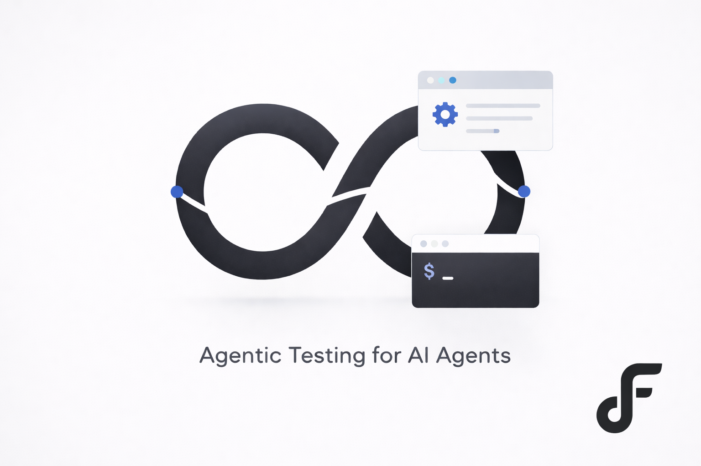

<p align="center">
  
</p>

# FluxLoop OSS

<p align="center">
  <a href="https://github.com/chuckgu/fluxloop"></a>
  <a href="https://github.com/chuckgu/fluxloop/blob/main/packages/LICENSE"></a>
  <a href="https://pypi.org/project/fluxloop/"></a>
  <a href="https://pypi.org/project/fluxloop-cli/"></a>
</p>

## Agentic Testing for AI Agents

> **"Hey, test my agent for order cancellation with angry customers"**  
> → FluxLoop handles the rest: setup, CLI install, synthesis, execution, and analysis.

### 🤖 Agent-First Workflow
Your coding agent (Claude Code) orchestrates the entire testing flow. Just describe what you want to test—FluxLoop does the heavy lifting.

### 🎯 Simulate at Scale
Run thousands of realistic multi-turn scenarios in parallel. Find edge cases before production.

### 📊 Align to Your Standards
Capture your implicit decision criteria. Turn intuition into automated evaluation.

---

## Getting Started

### ⭐ Claude Code Plugin (Recommended)

**Install the plugin, then just talk.**

```bash
/plugin install Fluxloop-AI/fluxloop-claude-plugin
```

That's it. Now say:

```
"test my agent for refund scenarios"
```

The **Agent Test Skill** handles everything:
- ✅ Installs FluxLoop CLI (if needed)
- ✅ Logs you in
- ✅ Creates project/scenario
- ✅ Synthesizes test inputs
- ✅ Runs simulations
- ✅ Analyzes results and suggests fixes

**No commands to memorize. No manual setup. Just ask.**

#### Example Conversation

```
User: "Test my chatbot for refund scenarios with frustrated customers"

Agent: Let me set up FluxLoop and run tests...

       ✓ FluxLoop CLI installed
       ✓ Logged in
       ✓ Project created
       ✓ 10 test inputs synthesized (40% hard cases)
       ✓ Running simulation...
       
       📊 Results: 8/10 passed (80%)
       ⚠️ Failed on edge case: customer requesting partial refund
       
       💡 Suggested fix: Add handling for partial refund requests
       
       Would you like me to analyze the failures in detail?
```

📖 **Documentation**: [docs.fluxloop.ai/claude-code](https://docs.fluxloop.ai/claude-code)

---

## 📦 Packages

### 1. Claude Code Plugin ⭐
**The primary way to use FluxLoop.** Your coding agent orchestrates the entire testing workflow through natural conversation.

| Feature | Description |
|---------|-------------|
| **Agent Test Skill** | Auto-activates on "test my agent", handles everything |
| **Zero Config** | Skill installs CLI, logs in, creates projects automatically |
| **Context-Aware** | Knows your setup state, guides you through missing steps |

📖 **Location**: `packages/fluxloop-plugin/`  
📖 **Docs**: [docs.fluxloop.ai/claude-code](https://docs.fluxloop.ai/claude-code)

### 2. CLI
**For power users and CI/CD pipelines.** Direct command-line control when you need it.

```bash
pip install fluxloop-cli
fluxloop test --scenario my-test
```

📖 **Docs**: [docs.fluxloop.ai/cli](https://docs.fluxloop.ai/cli)  
📦 **PyPI**: [fluxloop-cli](https://pypi.org/project/fluxloop-cli/)

### 3. SDK (Python 3.11+)
**Core instrumentation library.** Add `@fluxloop.agent()` decorator to trace agent execution.

```python
import fluxloop

@fluxloop.agent()
def my_agent(input: str) -> str:
    # Your agent logic
    return response
```

📖 **Docs**: [docs.fluxloop.ai/sdk](https://docs.fluxloop.ai/sdk)  
📦 **PyPI**: [fluxloop](https://pypi.org/project/fluxloop/)

---

## Key Features

### 🤖 Agentic Testing with Claude Code

Just talk naturally:

```
"Test my order-bot for cancellation scenarios"
"Generate edge cases for payment failures"
"Why did the last test fail?"
```

The skill understands context and adapts to your state.

### 🎯 Simple Instrumentation

Works with any Python agent framework:

```python
@fluxloop.agent()
def my_agent(input: str) -> str:
    # LangChain, LlamaIndex, custom—anything works
    return response
```

### 📊 Evaluation-First Testing

Define criteria, run reproducible experiments, get actionable insights.

### 🧪 Offline-First Simulation

Run experiments locally with full control. No cloud dependency for testing.

---

## What You Can Do

| Capability | How |
|------------|-----|
| **🤖 Conversational Testing** | "test my agent with angry customers" |
| **🎯 Instrument Agents** | `@fluxloop.agent()` decorator |
| **📝 Synthesize Inputs** | Skill generates realistic test data |
| **🧪 Run Simulations** | Batch experiments with parallel execution |
| **💬 Multi-Turn Conversations** | Auto-extend into dialogues |
| **📊 Analyze Results** | Get insights and fix suggestions |

---

## Links

| Resource | URL |
|----------|-----|
| **FluxLoop Web** | [alpha.app.fluxloop.ai](https://alpha.app.fluxloop.ai) |
| **Documentation** | [docs.fluxloop.ai](https://docs.fluxloop.ai) |
| **Claude Code Plugin** | [docs.fluxloop.ai/claude-code](https://docs.fluxloop.ai/claude-code) |
| **CLI Docs** | [docs.fluxloop.ai/cli](https://docs.fluxloop.ai/cli) |
| **SDK Docs** | [docs.fluxloop.ai/sdk](https://docs.fluxloop.ai/sdk) |

---

## 🤝 Why Contribute?

We're building the future of AI agent testing—where your coding agent tests your AI agents.

- **Improve agentic workflows**: Make the Claude Code skill smarter
- **Build framework adapters**: LangChain, LlamaIndex, CrewAI
- **Enhance synthesis**: Better intent-to-input generation
- **Develop evaluation methods**: Novel agent performance metrics

Check out our [contribution guide](CONTRIBUTING.md) and open issues.

---

## 🚨 Community & Support

- **Issues**: [GitHub Issues](https://github.com/chuckgu/fluxloop/issues)
- **Docs**: [docs.fluxloop.ai](https://docs.fluxloop.ai)

---

## 📄 License

FluxLoop is licensed under the [Apache License 2.0](LICENSE).
