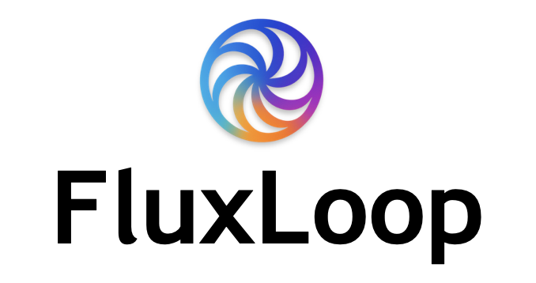

<p align="center">
  
</p>

# FluxLoop OSS

<p align="center">
  <a href="https://github.com/chuckgu/fluxloop"></a>
  <a href="https://github.com/chuckgu/fluxloop/blob/main/packages/LICENSE"></a>
  <a href="https://pypi.org/project/fluxloop/"></a>
  <a href="https://pypi.org/project/fluxloop-cli/"></a>
  <a href="https://pypi.org/project/fluxloop-mcp/"></a>
  <a href="https://marketplace.visualstudio.com/items?itemName=fluxloop.fluxloop"></a>
  <a href="https://open-vsx.org/extension/fluxloop/fluxloop"></a>
</p>

## Simulate, Evaluate, and Trust Your AI Agents

**FluxLoop is an open-source toolkit for running reproducible, offline-first simulations of AI agents against dynamic scenarios.** It empowers developers to rigorously test agent behavior, evaluate performance against custom criteria, and build confidence before shipping to production.

### Core Philosophy

- **Easy to Use**: Get started quickly with MCP integration and Flux Agent (TBD) for automated setup
- **Local-first**: Run experiments on your machine with full control and reproducibility
- **Framework-agnostic**: Works with any agent framework (LangGraph, LangChain, custom)
- **Evaluation-first**: Solve the AI evaluation problem properly with rigorous, offline-first testing

Stop guessing, start evaluating.

---

## Key Features

### 🤖 AI-Assisted Setup
Get started quickly with MCP Server integration that automatically detects your agent framework and guides you through the setup process. No more manual configuration or guesswork.

### 🎯 Simple Decorator-Based Instrumentation
Instrument existing agent code with minimal changes—just add `@fluxloop.agent()` and you're tracing. Works with any Python-based agent framework.

### 📊 Evaluation-First Testing
Rigorously test your agents with reproducible experiments and structured evaluation. Define rule-based and LLM-based evaluators, set success criteria, analyze trends and outliers, and generate comprehensive reports with customizable templates—all designed for proper AI evaluation.

### 🧪 Offline-First Simulation
Run experiments on your machine without cloud dependencies. Full control over your testing environment with reproducible, auditable results.

### 🔌 VSCode/Cursor Extension
Visual project management for your IDE. Browse projects, run experiments with one click, parse results into Markdown timelines, and explore outputs in a structured tree—all without leaving your editor.

Available on [VS Code Marketplace](https://marketplace.visualstudio.com/items?itemName=fluxloop.fluxloop) and [Open VSX (Cursor)](https://open-vsx.org/extension/fluxloop/fluxloop).

### 🚀 Powerful CLI
Complete command-line control for advanced workflows. Initialize projects, generate test inputs with LLM, run batch experiments, and parse results—all from your terminal.

---

## 📦 Packages

FluxLoop consists of multiple integrated packages that work together to provide a complete AI agent testing solution:

### 1. SDK (Python 3.11+)
**Core instrumentation library** for tracing and recording agent execution.

Add `@fluxloop.agent()` decorator to your code to automatically capture traces, observations, and execution context. Supports async, streaming, and complex agent frameworks.

📖 **Documentation**: [https://fluxloop.io/sdk/](https://fluxloop.io/sdk/)  
📦 **PyPI**: [fluxloop](https://pypi.org/project/fluxloop/)

### 2. CLI
**Command-line orchestration tool** for managing experiments end-to-end.

Initialize projects, generate test inputs with LLM, run batch simulations, and parse results into human-readable formats—all from your terminal.

📖 **Documentation**: [https://fluxloop.io/cli/](https://fluxloop.io/cli/)  
📦 **PyPI**: [fluxloop-cli](https://pypi.org/project/fluxloop-cli/)

### 3. VSCode Extension
**Visual project management** for Cursor and VS Code.

Browse projects, run experiments with one click, parse results into Markdown timelines, and explore outputs in a structured tree view—all without leaving your IDE.

📖 **Documentation**: [https://fluxloop.io/vscode/](https://fluxloop.io/vscode/)  
🛒 **Marketplaces**: [VS Code](https://marketplace.visualstudio.com/items?itemName=fluxloop.fluxloop) | [Open VSX (Cursor)](https://open-vsx.org/extension/fluxloop/fluxloop)

### 4. MCP Server (Python 3.11+)
**AI-assisted integration guidance** via Model Context Protocol.

Automatically detect your agent framework, suggest integration patterns, and provide context-aware help for setting up FluxLoop in your codebase.

📖 **Documentation**: [https://fluxloop.io/mcp/](https://fluxloop.io/mcp/)  
📦 **PyPI**: [fluxloop-mcp](https://pypi.org/project/fluxloop-mcp/)

### 5. Flux Agent (Beta)
**AI-powered integration assistant** built into the VSCode extension.

Flux Agent analyzes your code, consults FluxLoop documentation via MCP, and generates intelligent integration suggestions using LLM. It combines repository analysis with OpenAI models to provide contextualized, framework-specific guidance—without making automatic changes. You review and apply suggestions manually.

📖 **Documentation**: [https://fluxloop.io/vscode/integration-assistant/overview](https://fluxloop.io/vscode/integration-assistant/overview)  
✨ **Features**:
- Repository analysis and framework detection
- AI-generated code integration suggestions
- Knowledge search with citation-backed answers
- Manual review and application workflow

🔜 **Status**: Beta (available in VSCode extension v0.1.3+)

---

## Getting Started

### Installation

```bash
# Install Python packages (SDK and MCP require Python 3.11+)
pip install fluxloop fluxloop-cli fluxloop-mcp

# Install VSCode/Cursor Extension
# Search "FluxLoop" in Extensions marketplace
```

📖 **Installation Guides**: [SDK](https://fluxloop.io/sdk/getting-started/sdk-installation) | [CLI](https://fluxloop.io/cli/getting-started/cli-installation) | [VSCode](https://fluxloop.io/vscode/getting-started/installation) | [MCP](https://fluxloop.io/mcp/installation)

### Quick Workflow

```bash
# 1. Create a project
fluxloop init project --name my-agent

# 2. Add @fluxloop.agent() decorator to your code

# 3. Generate test inputs
fluxloop generate inputs --limit 50

# 4. Run experiment
fluxloop run experiment

# 5. Parse results
fluxloop parse experiment experiments/<experiment_dir>
```

📖 **Complete Tutorial**: [End-to-End Workflow Guide](https://fluxloop.io/docs/guides/getting-started)

### What You Can Do

- **🎯 Instrument Agents**: Add decorators to trace execution
- **📝 Generate Inputs**: Create test scenarios with LLM or deterministic strategies
- **🧪 Run Simulations**: Execute batch experiments with different configurations
- **📊 Analyze Results**: Parse structured outputs into human-readable timelines
- **🔴 Record & Replay**: Capture complex arguments and replay them (advanced)
- **🧠 AI-Assisted Setup**: Use MCP server and Flux Agent for automated integration guidance

---

## 🤝 Why Contribute?

Building trustworthy AI requires a community dedicated to rigorous, transparent evaluation. FluxLoop provides the foundational tooling, but there's much more to do:

- **Shape the standard**: Define the open contract for AI agent simulation data
- **Build integrations**: Create adapters for popular frameworks (LangChain, LlamaIndex, CrewAI)
- **Enhance developer experience**: Improve CLI, SDK, and VSCode extension
- **Develop evaluation methods**: Create novel ways of measuring agent performance

We're an early-stage project with an ambitious roadmap. Your contributions can have massive impact.

Check out our [contribution guide](CONTRIBUTING.md) and open issues to get started.

---

## 🚨 Community & Support

- **Issues**: Report bugs or suggest features on [GitHub](https://github.com/chuckgu/fluxloop/issues)

---

## 📄 License

FluxLoop is licensed under the [Apache License 2.0](LICENSE).
