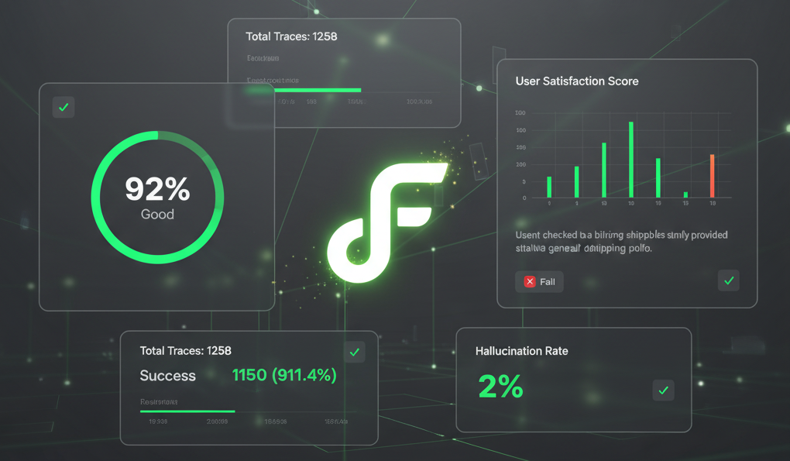

<p align="center">
  
</p>

# FluxLoop OSS

<p align="center">
  <a href="https://github.com/chuckgu/fluxloop"></a>
  <a href="https://github.com/chuckgu/fluxloop/blob/main/packages/LICENSE"></a>
  <a href="https://pypi.org/project/fluxloop/"></a>
  <a href="https://pypi.org/project/fluxloop-cli/"></a>
</p>

## Agentic Testing for AI Agents

> **"Hey, test my agent for order cancellation with angry customers"**  
> → FluxLoop handles the rest: setup, synthesis, execution, and analysis.

### 🤖 Agent-First Workflow
Your coding agent (Claude Code) orchestrates the entire testing flow. Just describe what you want to test—FluxLoop does the heavy lifting.

### 🎯 Simulate at Scale
Run thousands of realistic multi-turn scenarios in parallel. Find edge cases before production.

### 📊 Align to Your Standards
Capture your implicit decision criteria. Turn intuition into automated evaluation.

---

## Simulate, Evaluate, and Trust Your AI Agents

**FluxLoop is an open-source toolkit for agentic testing of AI agents.** Integrated with Claude Code, it enables your coding agent to autonomously set up test environments, synthesize inputs, run simulations, and analyze results—all through natural conversation.

### Core Philosophy

- **Agentic Testing**: Let your coding agent handle the entire test workflow through conversation
- **Zero Config**: Claude Code plugin auto-detects your setup and guides you through integration
- **Local-first**: Run experiments on your machine with full control and reproducibility
- **Framework-agnostic**: Works with any agent framework (LangGraph, LangChain, custom)

Stop configuring, start conversing.

---

## Key Features

### 🤖 Agentic Testing with Claude Code
Your coding agent becomes your test engineer. Just tell it what to test:

```
User: "Test my chatbot for refund scenarios with frustrated customers"

Agent: Setting up environment...
       ✓ Project created
       ✓ 10 test inputs synthesized (40% hard cases)
       ✓ Running simulation...
       
       ✅ 8/10 passed (80%)
       ⚠️ Failed on edge case: customer requesting partial refund
       
       💡 Suggested fix: Add handling for partial refund requests
```

**Slash Commands:**
- `/fluxloop:test` — Full test cycle (pull → run → upload)
- `/fluxloop:synthesis` — Generate test inputs from intent
- `/fluxloop:status` — Check current configuration

### 🎯 Simple Decorator-Based Instrumentation
Instrument existing agent code with minimal changes—just add `@fluxloop.agent()` and you're tracing. Works with any Python-based agent framework.

### 📊 Evaluation-First Testing
Rigorously test your agents with reproducible experiments and structured evaluation. Define rule-based and LLM-based evaluators, set success criteria, and generate comprehensive reports.

### 🧪 Offline-First Simulation
Run experiments on your machine without cloud dependencies. Full control over your testing environment with reproducible, auditable results.

### 🚀 Powerful CLI
Complete command-line control for advanced workflows. Initialize projects, generate test inputs with LLM, run batch experiments, and parse results—all from your terminal.

---

## 📦 Packages

FluxLoop consists of multiple integrated packages:

### 1. Claude Code Plugin ⭐
**Agentic testing interface** for Claude Code.

The primary way to use FluxLoop. Your coding agent orchestrates the entire testing workflow through natural conversation and slash commands.

📖 **Location**: `packages/fluxloop-plugin/`  
✨ **Commands**: `/fluxloop:test`, `/fluxloop:synthesis`, `/fluxloop:status`

### 2. CLI
**Command-line orchestration tool** for managing experiments end-to-end.

For power users and CI/CD pipelines. Initialize projects, generate test inputs, run batch simulations, and parse results.

📖 **Documentation**: [https://docs.fluxloop.ai/cli/](https://docs.fluxloop.ai/cli/)  
📦 **PyPI**: [fluxloop-cli](https://pypi.org/project/fluxloop-cli/)

### 3. SDK (Python 3.11+)
**Core instrumentation library** for tracing and recording agent execution.

Add `@fluxloop.agent()` decorator to your code to capture traces and execution context.

📖 **Documentation**: [https://docs.fluxloop.ai/sdk/](https://docs.fluxloop.ai/sdk/)  
📦 **PyPI**: [fluxloop](https://pypi.org/project/fluxloop/)

---

## Getting Started

### Option 1: Claude Code (Recommended)

1. **Install the plugin** — Add `packages/fluxloop-plugin` to your Claude Code plugins
2. **Login** — `fluxloop login` (one-time browser auth)
3. **Start testing** — Just tell Claude Code what to test:

```
"Test my order-bot agent for cancellation scenarios"
```

Claude Code will:
- Create project/scenario if needed
- Synthesize test inputs based on your intent
- Set up the agent loader
- Run tests and analyze results

### Option 2: CLI

```bash
# Install Python packages (Python 3.11+)
pip install fluxloop fluxloop-cli

# Quick workflow
fluxloop init project --name my-agent
fluxloop generate inputs --limit 50
fluxloop run experiment
fluxloop parse experiment experiments/<experiment_dir>
```

📖 **Documentation**: [SDK](https://docs.fluxloop.ai/sdk/) | [CLI](https://docs.fluxloop.ai/cli/)

### What You Can Do

- **🤖 Conversational Testing**: Describe what to test in natural language
- **🎯 Instrument Agents**: Add `@fluxloop.agent()` decorator to trace execution
- **📝 Intent-Based Synthesis**: Generate test inputs from high-level descriptions
- **🧪 Run Simulations**: Execute batch experiments with different configurations
- **💬 Multi-Turn Conversations**: Automatically extend into multi-turn dialogues
- **📊 Analyze Results**: Get actionable insights and improvement suggestions

---

## 🤝 Why Contribute?

We're building the future of AI agent testing—where your coding agent tests your AI agents. There's much to do:

- **Improve agentic workflows**: Make the Claude Code integration smarter and more autonomous
- **Build framework adapters**: LangChain, LlamaIndex, CrewAI, and more
- **Enhance synthesis**: Better intent-to-input generation
- **Develop evaluation methods**: Novel ways of measuring agent performance

Early-stage project with massive impact potential.

Check out our [contribution guide](CONTRIBUTING.md) and open issues to get started.

---

## 🚨 Community & Support

- **Issues**: Report bugs or suggest features on [GitHub](https://github.com/chuckgu/fluxloop/issues)

---

## 📄 License

FluxLoop is licensed under the [Apache License 2.0](LICENSE).
