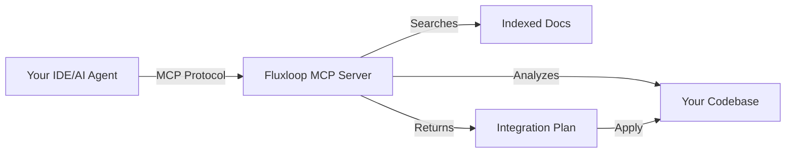

# Fluxloop MCP Server

**AI-powered integration assistant for Fluxloop SDK via Model Context Protocol.**

The Fluxloop MCP Server provides intelligent guidance for integrating the Fluxloop SDK into your projects. Instead of manually reading documentation and figuring out which files to modify, the MCP server analyzes your codebase and provides framework-specific integration plans.

## What is MCP?

[Model Context Protocol (MCP)](https://modelcontextprotocol.io) is an open standard that enables AI assistants (like Claude, Cursor, or custom agents) to securely access external data sources and tools. The Fluxloop MCP Server exposes tools for:

- **Documentation Q&A**: Search Fluxloop docs with citations
- **Repository Analysis**: Detect languages, frameworks, and entry points
- **Integration Planning**: Generate step-by-step setup instructions
- **Edit Plan Validation**: Check file existence and anchor patterns before applying changes

## How It Works



1. **Analysis**: Scans your project to identify languages, package managers, and frameworks
2. **Detection**: Recognizes Express, FastAPI, Next.js, NestJS, and more
3. **Planning**: Generates tailored integration steps with code snippets
4. **Validation**: Verifies anchors exist and warns about conflicts
5. **Guidance**: Provides rollback instructions and post-integration checks

## Supported Frameworks

| Framework | Language | Runner Pattern | Status |
|-----------|----------|----------------|--------|
| FastAPI | Python | `python-function` | ✅ Production |
| Express | TypeScript/JS | `http-rest` | ✅ Production |
| Next.js | TypeScript/JS | `http-rest` | ✅ Production |
| NestJS | TypeScript | `http-rest` | ✅ Production |
| Django | Python | `python-function` | 🚧 Planned |
| Flask | Python | `python-function` | 🚧 Planned |

## Quick Example

```bash
# Install MCP server
pip install fluxloop-mcp

# Build knowledge index
fluxloop-mcp rebuild-index

# Test a query
fluxloop-mcp --once --query "How do I integrate FastAPI?"
```

**Response:**
```json
{
  "answer": "Install `fluxloop` via pip, then add @fluxloop.trace() decorator...",
  "citations": [
    "packages/website/docs-cli/configuration/runners/python-function.md"
  ]
}
```

## Benefits

- **⚡ Faster Onboarding**: Get integration steps in seconds vs hours of manual reading
- **🎯 Accurate Guidance**: Framework-specific recipes based on actual code structure
- **🔍 Citation-Backed**: Every answer links to source documentation
- **🛡️ Safe**: Read-only analysis with validation before any changes
- **🔌 Extensible**: Works with any MCP-compatible AI assistant

## Next Steps

- [Installation & Setup](./installation.md)
- [Using with Cursor/Claude](./usage-cursor.md)
- [Tool Reference](./tools-reference.md)
- [Advanced Configuration](./configuration.md)

