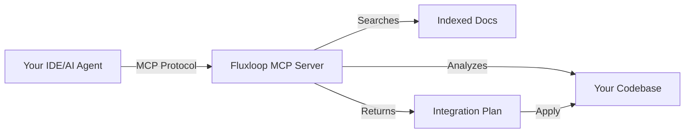

# Fluxloop MCP Server

**AI-powered integration assistant for Fluxloop SDK via Model Context Protocol.**

The Fluxloop MCP Server provides intelligent guidance for integrating the Fluxloop SDK into your projects. Instead of manually reading documentation and figuring out which files to modify, the MCP server analyzes your codebase and provides framework-specific integration plans.

## Version

Current version: **0.1.1**

## What is MCP?

[Model Context Protocol (MCP)](https://modelcontextprotocol.io) is an open standard that enables AI assistants (like Claude, Cursor, or custom agents) to securely access external data sources and tools. The Fluxloop MCP Server exposes tools for:

- **Documentation Q&A**: Search Fluxloop docs with RAG-based retrieval and citations
- **Repository Analysis**: Detect languages, frameworks, package managers, and entry points
- **Framework Detection**: Identify Express, FastAPI, Next.js, NestJS with confidence scoring
- **Integration Planning**: Generate framework-specific step-by-step setup instructions
- **Edit Plan Proposal**: Create structured edit plans with anchors and validation
- **Plan Validation**: Check file existence, anchor patterns, and conflicts before applying changes
- **Multi-Mode Context APIs**: Support for Integration, Base Input, Experiment, and Insight modes (used by VS Code extension)

## How It Works



1. **Analysis**: Scans your project to identify languages, package managers, and frameworks
2. **Detection**: Recognizes Express, FastAPI, Next.js, NestJS, and more with confidence scores
3. **Planning**: Generates tailored integration steps with code snippets
4. **Validation**: Verifies anchors exist and warns about conflicts
5. **Guidance**: Provides rollback instructions and post-integration checks

## Supported Frameworks

| Framework | Language | Runner Pattern | Status |
|-----------|----------|----------------|--------|
| FastAPI | Python | `python-function` | ✅ Production |
| Express | TypeScript/JS | `http-rest` | ✅ Production |
| Next.js | TypeScript/JS | `http-rest` | ✅ Production |
| NestJS | TypeScript | `http-rest` | ✅ Production |
| Django | Python | `python-function` | 🚧 Planned |
| Flask | Python | `python-function` | 🚧 Planned |
| Svelte | TypeScript/JS | `http-rest` | 🚧 Planned |

## Quick Example

```bash
# Install MCP server
pip install fluxloop-mcp

# Build knowledge index
fluxloop-mcp rebuild-index

# Test a query
fluxloop-mcp --once --query "How do I integrate FastAPI?"
```

**Response:**
```json
{
  "answer": "Install `fluxloop` via pip, then add @fluxloop.trace() decorator...",
  "citations": [
    "packages/website/docs-cli/configuration/runners/python-function.md"
  ]
}
```

## Available Tools

The MCP server provides these tools via the Model Context Protocol:

| Tool | Description |
|------|-------------|
| `handshake` | Returns server metadata and capabilities |
| `faq` | RAG-based documentation search with citations |
| `analyze_repository` | Scans project structure, languages, frameworks |
| `detect_frameworks` | Identifies frameworks with confidence scores |
| `generate_integration_steps` | Creates framework-specific integration checklist |
| `propose_edit_plan` | Generates structured edit plan with anchors |
| `validate_edit_plan` | Verifies plan structure and checks conflicts |
| `run_integration_workflow` | Executes full pipeline (analyze → validate) |
| `fetch_integration_context` | Returns repo profile + integration workflow for VS Code planner |
| `fetch_base_input_context` | Packages base input samples and service settings |
| `fetch_experiment_context` | Summarizes past experiments and runner configs |
| `fetch_insight_context` | Collects evaluation reports and metrics |

## Multi-Mode Support

The Flux Agent in VS Code extension uses these context APIs:

| Mode | MCP Tool | Purpose |
|------|----------|---------|
| Integration | `fetch_integration_context` | Repository analysis and integration planning |
| Base Input | `fetch_base_input_context` | Input generation and persona setup |
| Experiment | `fetch_experiment_context` | Experiment running and configuration |
| Insight | `fetch_insight_context` | Results analysis and evaluation |

Currently, only **Integration** mode is fully implemented in the VS Code extension.

## Benefits

- **⚡ Faster Onboarding**: Get integration steps in seconds vs hours of manual reading
- **🎯 Accurate Guidance**: Framework-specific recipes based on actual code structure
- **🔍 Citation-Backed**: Every answer links to source documentation
- **🛡️ Safe**: Read-only analysis with validation before any changes
- **🔌 Extensible**: Works with any MCP-compatible AI assistant (Cursor, Claude Desktop, VS Code)
- **📚 RAG-Powered**: BM25 + embedding hybrid retrieval with FAISS or Qdrant backends

## Architecture

```
fluxloop_mcp/
├── server.py           # stdio MCP server entry point
├── tools/              # Tool implementations
│   ├── faq.py
│   ├── analyze_repository.py
│   ├── detect_frameworks.py
│   ├── generate_integration_steps.py
│   ├── propose_edit_plan.py
│   ├── validate_edit_plan.py
│   └── run_integration_workflow.py
├── index/              # Document indexing & retrieval
│   ├── ingestor.py
│   ├── store.py
│   ├── retriever.py
│   ├── embedder.py
│   └── validator.py
├── recipes/            # Framework integration recipes
│   └── registry.py
└── schemas/            # JSON schemas for validation
    ├── repository_profile.json
    ├── edit_plan.json
    └── runner_pattern_metadata.json
```

## Next Steps

- **[Installation & Setup](./installation.md)** - Install and configure the MCP server
- **[Using with Cursor](./usage-cursor.md)** - Integrate with Cursor IDE
- **[Using with VS Code](./usage-vscode.md)** - Integrate with VS Code Flux Agent
- **[Tool Reference](./tools-reference.md)** - Detailed API documentation
- **[Configuration](./configuration.md)** - Advanced configuration options
- **[Examples](./examples.md)** - Practical usage examples


