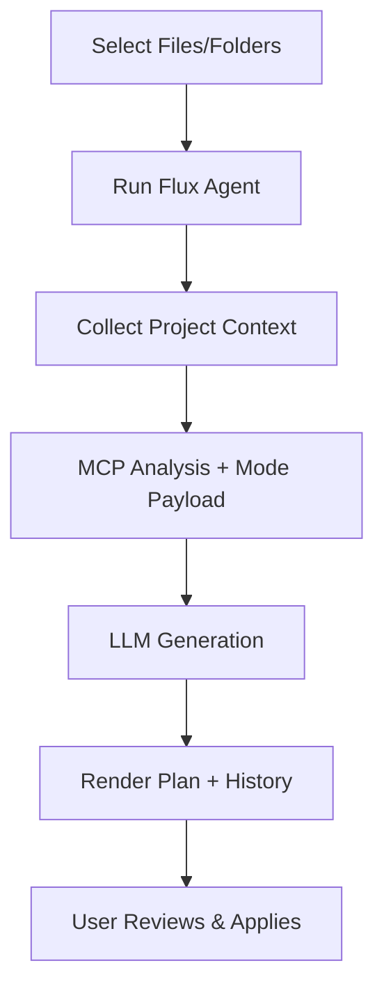

# Integration Assistant Overview

The **Integration Assistant** is a powerful feature in the FluxLoop VSCode extension that helps you integrate FluxLoop SDK into your project with AI-guided suggestions.

## What is the Integration Assistant?

Integration Assistant combines four key technologies:

1. **FluxLoop MCP Server** – Provides documentation, recipes, and framework-specific workflows
2. **Repository Analysis** – Runs `run_integration_workflow` to detect languages, frameworks, entry points, and risk flags
3. **Mode-Specific Context APIs** – Integration, Base Input, Experiment, and Insight payloads (Integration mode available today; others in preview)
4. **LLM Suggestions** – Uses OpenAI Chat Completions models to generate contextualized integration plans

## Key Features

### 🔍 Knowledge Search
- Ask documentation questions directly from VSCode
- Answers include file citations and section names
- Great for quick “how do I configure X?” lookups before running the agent

### 🤖 Flux Agent
- Analyzes the folders/files you select (no need to open the file)
- Combines MCP repository data + mode-specific context with OpenAI reasoning
- Generates structured plans (summary, suggested edits, validation checklist, references)
- Keeps the human-in-the-loop: suggestions are review-only

### 📊 System Status
- Real-time MCP connection and knowledge index checks
- Environment + dependency validation (CLI, SDK, MCP)
- One-click access to `FluxLoop: Run Doctor`

### 📝 Suggestion History
- Stores your last five suggestions per project
- Reopen any entry with full context and copy buttons
- Helpful for comparing iterations or sharing plans with teammates

## How It Works

1. **Context Collection** – You pick folders/files; the agent also reads `source_root`, project metadata, and selection snippets (if any).
2. **MCP Analysis** – Runs `run_integration_workflow` plus mode-specific context tools (Integration today; Base Input/Experiment/Insight in preview) to gather repo profile, detection results, and suggested edits.
3. **LLM Generation** – Sends all context to the configured OpenAI Chat Completions model to craft a plan.
4. **Presentation** – Renders Markdown with summary, suggested edits, validation checklist, and citations. Copy buttons make applying changes easy.
5. **Manual Application** – You review, copy, and apply changes manually in your codebase.

## Benefits

- **Faster Integration**: Get framework-specific guidance in seconds
- **Accurate Recommendations**: Based on your actual code structure
- **Safe**: No automatic modifications, you control all changes
- **Learning Tool**: Understand why and where to make changes
- **Traceable**: Full citation chain from suggestion to source docs

## Prerequisites

Before using Integration Assistant, ensure you have:

- Python **3.11+** (Flux Agent uses the MCP server)
- `fluxloop-cli`, `fluxloop`, and `fluxloop-mcp` installed in the active environment
- MCP knowledge index built (`packages/mcp/scripts/rebuild_index.sh`)
- `configs/project.yaml` includes the correct `source_root` (set via **Target Source Root…**)
- OpenAI API key (prompted on first use; securely stored if you allow it)

## Next Steps

- [Setup Guide](./setup.md) - Install and configure the Integration Assistant
- [Knowledge Search](./knowledge-search.md) - Search FluxLoop documentation
- [Using Flux Agent](./flux-agent.md) - Generate code suggestions
- [Troubleshooting](./troubleshooting.md) - Common issues and solutions

