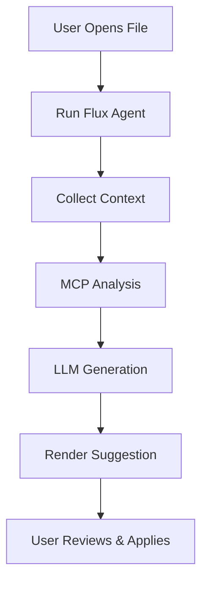

# Integration Assistant Overview

The **Integration Assistant** is a powerful feature in the FluxLoop VSCode extension that helps you integrate FluxLoop SDK into your project with AI-guided suggestions.

## What is the Integration Assistant?

Integration Assistant combines three key technologies:

1. **FluxLoop MCP Server**: Provides knowledge about FluxLoop documentation, recipes, and framework-specific patterns
2. **Repository Analysis**: Scans your codebase to detect languages, frameworks, and integration points
3. **LLM Suggestions**: Uses OpenAI GPT models to generate contextualized code modification suggestions

## Key Features

### 🔍 Knowledge Search
- Query FluxLoop documentation directly from VSCode
- Get answers with source citations
- Access framework-specific recipes and examples

### 🤖 Flux Agent
- Analyzes your current file and project structure
- Combines MCP insights with LLM reasoning
- Generates detailed integration suggestions in Markdown format
- **No automatic code changes** - you review and apply suggestions manually

### 📊 System Status
- Real-time MCP connection monitoring
- Python environment and package validation
- Knowledge index status tracking

### 📝 Suggestion History
- Stores recent suggestions with full context
- Revisit previous plans anytime
- Copy code snippets with one click

## How It Works

1. **Context Collection**: Gathers active file, selected code block, and project metadata
2. **MCP Analysis**: Runs `run_integration_workflow` to analyze repository and detect frameworks
3. **LLM Generation**: Sends analysis + context to OpenAI model for intelligent suggestions
4. **Presentation**: Displays plan in dedicated panel with copy/check actions
5. **Manual Application**: You review, copy, and apply changes yourself

## Benefits

- **Faster Integration**: Get framework-specific guidance in seconds
- **Accurate Recommendations**: Based on your actual code structure
- **Safe**: No automatic modifications, you control all changes
- **Learning Tool**: Understand why and where to make changes
- **Traceable**: Full citation chain from suggestion to source docs

## Prerequisites

Before using Integration Assistant, ensure you have:

- Python 3.11 or newer
- `fluxloop-mcp` package installed (`pip install fluxloop-mcp`)
- MCP knowledge index built (runs automatically or via `rebuild_index.sh`)
- OpenAI API key (prompted on first use, can be stored securely)

## Next Steps

- [Setup Guide](./setup.md) - Install and configure the Integration Assistant
- [Knowledge Search](./knowledge-search.md) - Search FluxLoop documentation
- [Using Flux Agent](./flux-agent.md) - Generate code suggestions
- [Troubleshooting](./troubleshooting.md) - Common issues and solutions

