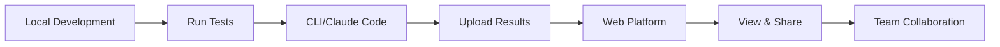

# Web Platform Overview

FluxLoop Web Platform is a cloud-based AI agent testing and simulation platform. It visualizes test results generated from CLI and Claude Code plugin, enables team collaboration, and tracks agent performance.

## What is FluxLoop Web?

FluxLoop Web provides three core capabilities:

1. **Result Visualization**: Visualize test results executed locally on the web
2. **Team Collaboration**: Share projects and scenarios with team members
3. **Scenario Management**: Centrally manage test scenarios in the cloud

## How It Works



### 1. Run Tests Locally

Test your agent locally using Claude Code or CLI:

```bash
# Claude Code
/fluxloop test

# CLI
fluxloop test
```

### 2. Upload Results

After tests complete, automatically upload results to the web platform:

```bash
fluxloop sync upload
```

### 3. View on Web

View and analyze results at [results.fluxloop.ai](https://results.fluxloop.ai).

## Key Features

### 📊 Result Visualization

View test results in an intuitive dashboard:

- **Conversation Traces**: Conversation flow between agent and users
- **Performance Metrics**: Response time, token usage, success rate
- **Error Analysis**: Root cause analysis of failed tests
- **Comparison Views**: Compare multiple test runs

### 🤝 Team Collaboration

Develop agents together with your team:

- **Shared Projects**: Share projects with team members
- **Scenario Library**: Manage reusable test scenarios
- **Comments & Feedback**: Add comments directly to results
- **Access Control**: Manage permissions per project

### 🔄 Cloud Sync

Automatic synchronization between local and cloud:

- **Pull Scenarios**: Import scenarios created on the web to local
- **Push Results**: Upload local test results to web
- **Version Control**: Scenario version management
- **API Access**: Programmatic access via API keys

## Getting Started

### 1. Create Account

Create a free account at [app.fluxloop.ai](https://app.fluxloop.ai).

### 2. Generate API Key

Generate an API key on the web platform:

1. Settings → API Keys
2. Click "Create New API Key"
3. Enter key name (e.g., "My Development Key")
4. Save the generated key securely

### 3. Authenticate Locally

Authenticate using the API key in CLI or Claude Code:

```bash
# Claude Code
/fluxloop setup

# CLI
fluxloop auth login
```

### 4. Connect Project

Connect your local project to a web platform project:

```bash
fluxloop projects
```

### 5. Pull Scenarios

Import scenarios created on the web to local:

```bash
fluxloop sync pull
```

You're all set! Run tests locally and view results on the web.

## Web Platform vs. Local Testing

| Feature | Local (CLI/Claude Code) | Web Platform |
|---------|------------------------|--------------|
| Test Execution | ✅ Run tests locally | ❌ No execution (view only) |
| Result Storage | 📁 Local files | ☁️ Cloud storage |
| Visualization | 📄 JSON/Terminal output | 📊 Interactive dashboard |
| Team Sharing | ❌ Manual file sharing | ✅ Automatic sharing |
| History | 🔄 Git-based | ⏱️ Built-in versioning |
| Collaboration | 💬 External tools needed | 💬 Built-in comments |
| Access Control | 🔐 File system permissions | 🔐 Role-based access |

## Use Cases

### Individual Developers

Test quickly locally and upload only important results to the web:

```bash
# Quick local test
fluxloop test

# Upload only important results
fluxloop sync upload --scenario "critical-paths"
```

### Team Development

Share scenarios with teammates and analyze results together:

```bash
# Pull team scenarios
fluxloop sync pull

# Run tests
fluxloop test

# Upload results (teammates can view immediately)
fluxloop sync upload
```

### CI/CD Pipeline

Monitor automated test results on the web:

```yaml
# .github/workflows/test.yml
- name: Run FluxLoop Tests
  run: |
    fluxloop test
    fluxloop sync upload
  env:
    FLUXLOOP_API_KEY: ${{ secrets.FLUXLOOP_API_KEY }}
```

## Pricing

FluxLoop Web Platform offers the following plans:

- **Free**: For individual developers (100 test runs/month)
- **Team**: For team collaboration (1,000 test runs/month)
- **Enterprise**: For large organizations (unlimited test runs)

For detailed pricing information, visit [fluxloop.ai/pricing](https://fluxloop.ai/pricing).

## Next Steps

- [Projects and Scenarios](./projects-and-scenarios.md): How to manage projects and scenarios
- [Viewing Results](./viewing-results.md): How to view and analyze test results
- [API Keys](./api-keys.md): How to create and manage API keys

## Support

Have questions or issues?

- 📧 Email: [support@fluxloop.ai](mailto:support@fluxloop.ai)
- 💬 Discord: [FluxLoop Community](https://discord.gg/fluxloop)
- 🐛 GitHub: [Report an Issue](https://github.com/chuckgu/fluxloop/issues)
